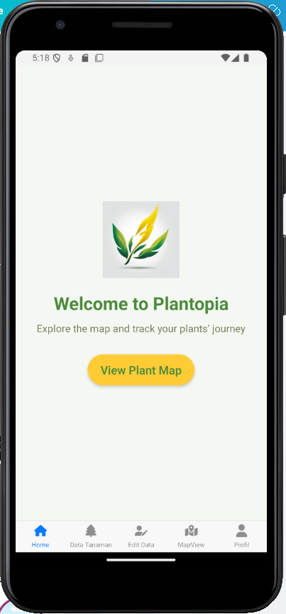
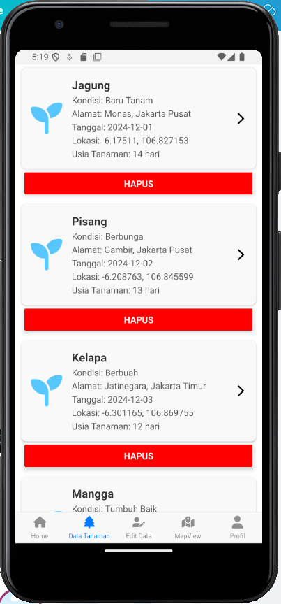
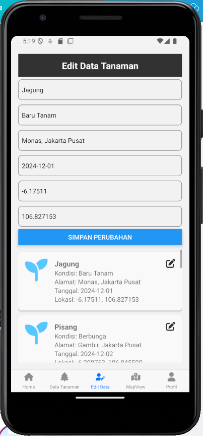
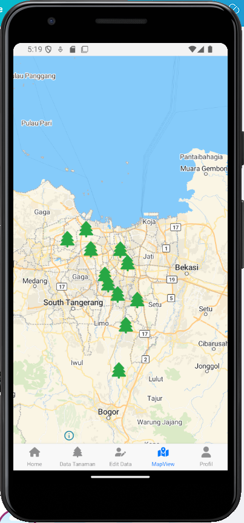
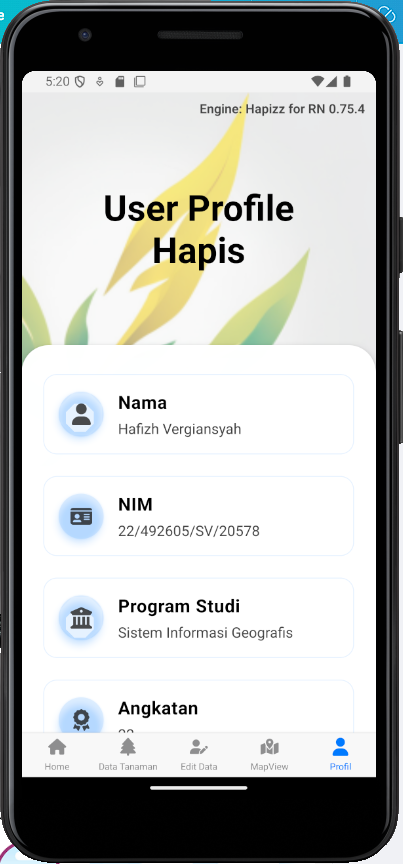

# **Plantopia**

## **Deskripsi Produk**
**Plantopia** adalah aplikasi mobile yang membantu pengguna dalam **mencatat, memantau**, dan **memetakan** pertumbuhan tanaman secara efisien. Dengan fitur-fitur seperti **mapping lokasi tanaman** dan **pengelolaan data tanaman**, Plantopia menjadi solusi modern bagi penghobi tanaman, petani, maupun peneliti yang ingin merawat tanaman dengan lebih sistematis.

---

## **Komponen Pembangun Produk**
Plantopia dikembangkan menggunakan teknologi dan komponen berikut:  
1. **React Native** - Framework utama untuk membangun aplikasi mobile lintas platform (Android & iOS).  
2. **MapLibre** - Library peta open-source untuk menampilkan data lokasi tanaman.  
3. **Map Tiles** - Digunakan sebagai lapisan peta dalam fitur MapView.  
4. **JSON Server** - Digunakan untuk menyimpan dan menyajikan data tanaman secara lokal atau remote.  
5. **Font Awesome** - Library ikon yang digunakan untuk menambahkan ikon pada navigasi dan antarmuka pengguna.  

---

## **Sumber Data**
Data yang digunakan dalam aplikasi **Plantopia** sepenuhnya berasal dari **input pengguna**. Pengguna dapat menambahkan, memperbarui, dan menghapus data tanaman sesuai kebutuhan.

---

## **Tangkapan Layar Komponen Penting Produk**

### **1. Tampilan Utama (Home)**
Halaman utama dengan akses ke fitur utama aplikasi.  
  

### **2. Data Tanaman**
Menampilkan daftar tanaman dengan informasi lengkap seperti kondisi, alamat, tanggal tanam, dan usia tanaman.  
  

### **3. Edit Data Tanaman**
Fitur untuk memperbarui informasi tanaman secara mudah.  
  

### **4. Pemetaan Lokasi (Map View)**
Visualisasi lokasi tanaman dalam peta menggunakan **MapLibre**.  
  

### **5. Profil Pengguna**
Halaman profil pengguna untuk personalisasi.  
  

---